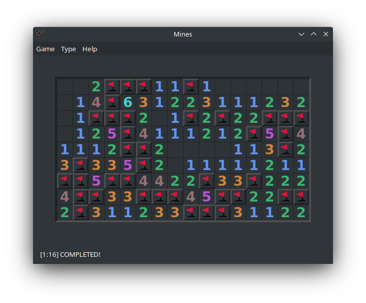

# DarkPuzzles
Fork of Simon Tatham's puzzle collection, with dark themes for GTK+ for those who love puzzles and also love their eyesight.

---

## Compiling
To compile the project run the following commands, cmake required.  
`mkdir build && cd build`  
`cmake ..`  
`make`  
At this point you can run the binaries in the `build` directory, if you wish to install the puzzle collection in your system run `sudo make install`. To uninstall run `sudo xargs rm < install_manifest.txt` from the `build` directory.

---

## dark.h
The color library, based on CSS built-in extended colors.

---

## Dark-Ready Puzzles:
- Inertia
- Mines
- Net
